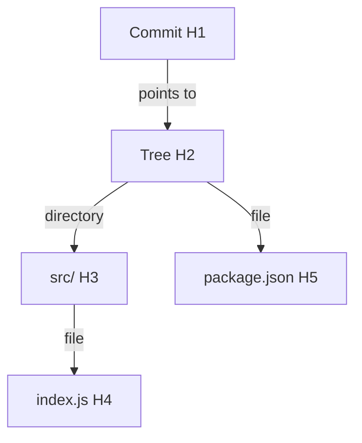

# Custom Version Control System (VCS)
> This project reconstructs core Git internals using first-principles system design.
A Git-inspired version control backend engineered from first principles to model how modern systems manage data integrity, version history, and state transitions.

## Why This Project?

Modern version control systems like Git abstract away complex internal mechanisms. This project was built to demystify those internals by focusing on the core principles of content-addressable storage, Merkle trees, and immutable state transitions.

The goal is to understand how correctness, integrity, and efficiency are achieved at the storage and data-structure level.

---

## Overview

This system implements a minimal yet robust version control model that:

- Tracks file changes using content-addressable storage  
- Represents filesystem state through hierarchical hashing  
- Maintains version history via a graph-based model  
- Ensures strong consistency through immutability  

It is designed for backend engineering demonstrations, system design discussions, and understanding internal VCS architecture.

---

## Key Contributions

- Architected a content-addressable storage model using SHA-based hashing to uniquely identify and deduplicate file versions  
- Designed a Merkle Tree-inspired structure to represent directory state and enable efficient reconstruction and comparison  
- Modeled commit history as a directed acyclic graph (DAG) to support scalable version tracking  
- Enforced immutability across commits to guarantee deterministic state transitions and eliminate side effects  
- Implemented low-level storage primitives for blob and tree objects, optimizing filesystem persistence and retrieval  

---

## System Architecture

### Content-Addressable Storage
- Files (blobs) and directories (trees) are stored using hashes derived from their content  
- Ensures:
  - Data integrity  
  - Deduplication  
  - Referential consistency  

---

### Merkle Tree Representation



> Each object is identified by a cryptographic hash, and any modification propagates upward, producing a new root hash and ensuring integrity.
> This structure enables efficient change detection, deduplication, and consistent snapshot reconstruction.

- Filesystem state is modeled as a hierarchical tree of hashes  
- Hash changes propagate upward, updating parent nodes  
- Enables:
  - Efficient state reconstruction  
  - Fast change detection  
  - Reliable version comparison  

### Commit Graph (DAG)
- Commits are represented as nodes in a directed acyclic graph  
- Each commit references:
  - Root tree snapshot  
  - Parent commit(s)  
- Enables:
  - History traversal  
  - Rollback and recovery  
  - Extensibility for branching  

---

### Immutability Model
- Commits are immutable snapshots of repository state  
- Prevents in-place mutation and ensures predictable behavior  
- Guarantees:
  - Deterministic state transitions  
  - Concurrency safety  
  - Reliable recovery  

---

### Storage Engine
- Implemented primitives:
  - Blob objects → file contents  
  - Tree objects → directory structures  
- Storage design:
  - Local filesystem with atomic write operations to prevent partial state corruption  
- Optimized for:
  - Efficient disk I/O  
  - Fast lookup via tree traversal  
  - Minimal redundancy through hashing  

---

## Features

- Initialize repository  
- Stage files (indexing layer)  
- Create commits with snapshot hashing  
- Traverse commit history  
- Revert to previous versions  
- Authentication and role-based authorization  
- RESTful APIs for version control operations  

---
## API Examples

### Initialize Repository
POST /init

### Stage Files
POST /add
{
  "filePath": "src/index.js"
}

### Commit Changes
POST /commit
{
  "message": "Initial commit"
}

### Get Commit History
GET /history

### Revert to Previous Commit
POST /revert
{
  "commitId": "abc123"
}

## Tech Stack

- Backend: Node.js, Express.js  
- Language: JavaScript  
- Storage: Local filesystem (atomic writes for consistency)  

##  Design Decisions

### Why Content-Addressable Storage?
Chosen to ensure deduplication, integrity, and deterministic state tracking.

### Why Immutability?
Prevents side effects and guarantees consistent history traversal.

### Why Filesystem Instead of DB?
Simplifies storage layer and mirrors Git’s object storage model for learning purposes.

### Why DAG for Commits?
Allows scalable history tracking and enables future support for branching and merging.

Core Concepts:
- SHA-based hashing  
- Content-addressable storage  
- Merkle trees  
- Directed acyclic graphs (DAGs)  
- Immutability  

---

## Project Structure

```text
.
├── controllers/        # Core operations (init, add, commit, revert, history)
├── middleware/         # Authentication and authorization
├── storage/            # Blob and tree persistence
├── routes/             # API definitions
└── index.js            # Application entry point

---
```
## Performance Considerations

- Hash-based storage avoids duplicate file writes  
- Tree traversal enables efficient snapshot reconstruction  
- Immutable design simplifies concurrent operations  
- Filesystem operations optimized using minimal writes  

## Workflow
init → add → commit → history → revert

Each commit produces a new immutable snapshot of the repository state.

---
## Reliability & Edge Cases

- Atomic write operations prevent partial commits  
- Hash validation ensures data integrity  
- Duplicate file states handled via content hashing  
- Safe rollback ensures repository consistency after failures  

## Limitations

- No distributed synchronization  
- No branching or merging (architecture is DAG-ready)  
- No command-line interface  

These trade-offs are intentional to maintain focus on core system design principles.

---

## Future Enhancements

- Branching and merge algorithms  
- Distributed repository synchronization  
- Delta compression (Git-style packfiles)  
- Garbage collection for unused objects  
- CLI interface  

---
## Learnings

- Deep understanding of how Git internally manages data  
- Practical experience with Merkle trees and DAG-based systems  
- Insights into designing immutable and consistent storage systems  
- Stronger intuition for backend system design trade-offs  

## Author

Revanth Y  
GitHub: https://github.com/revanth4y  

---

## Summary

This project demonstrates a first-principles approach to building a version control system, focusing on storage design, data structures, and consistency guarantees. It reflects core ideas used in real-world systems like Git and aligns closely with backend and distributed systems engineering problems.
